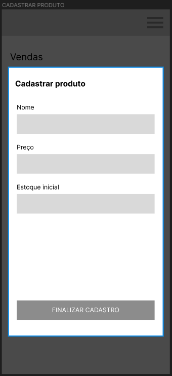
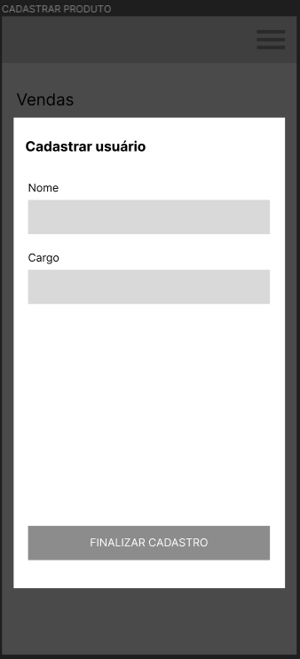
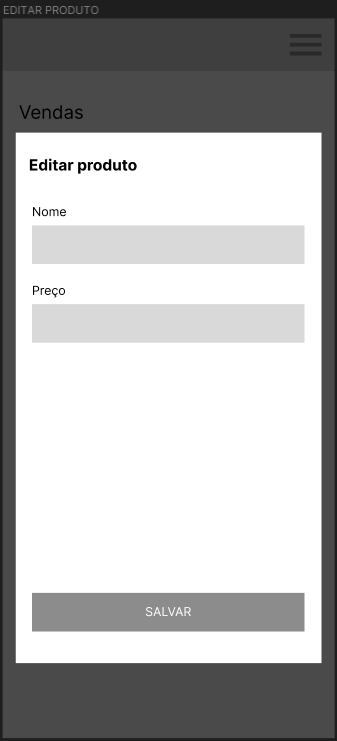

# Projeto de Interface

Pré-requisitos: <a href="2-Especificação do Projeto.md"> Documentação de Especificação</a>

Visão geral da interação do usuário pelas telas do sistema e protótipo interativo das telas com as funcionalidades que fazem parte do sistema (wireframes).

 Apresente as principais interfaces da plataforma. Discuta como ela foi elaborada de forma a atender os requisitos funcionais, não funcionais e histórias de usuário abordados nas <a href="2-Especificação do Projeto.md"> Documentação de Especificação</a>.

## Diagrama de Fluxo

O diagrama foi estruturado a fim de exibir o fluxo de interação do usuário com o sistema, facilitando assim a visão de como deve ser desenvolvido o programa. Abaixo são explicitadas as funções das telas.

- **Login**: tela inicial onde o gestor, vendedor e estoquista farão login.

- **Tela de usuários (funcionários)**: tela a qual o gestor terá a possibilidade de listar, editar, cadastrar e remover usuário.

- **Tela de vendas (gestor)**: tela específica onde o gestor terá a possibilidade de gerar o relatório de vendas.

- **Tela de produtos**: tela a qual terá as opções de cadastrar, remover, editar e listar produto.

- **Tela de vendas**: tela onde o gestor e o vendedor terão acesso afim de editar, cadastrar, remover e vizualizar venda.

- **Tela de estoque**: tela onde será possível a listagem de estoque. 

- **Tela de registro de mercadorias**: tela a qual terá as opções de gerar relatório de estoque e registrar entrada de mercadoria.

## Wireframes

### Tela Cadastrar Produto

### Tela Cadastrar Usuário

### Tela Cadastrar Venda

### Tela Editar Produto

### Tela Entrada Produto

### Tela Estoque

### Tela Login

### Tela Menu

### Tela Produtos

### Tela Relatório Vendas

### Tela Vendas

