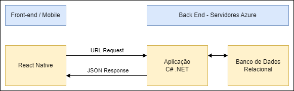

# Arquitetura da Solução

Pré-requisitos: <a href="3-Projeto de Interface.md"> Projeto de Interface</a>

Definição de como o software é estruturado em termos dos componentes que fazem parte da solução e do ambiente de hospedagem da aplicação.

## Diagrama de Classes

O diagrama foi estruturado considerando a necessidade do cliente em otimizar seu sistema interno relacionado ao controle de estoque e venda de produtos (condições para gerir os processos logísticos e financeiros da empresa com agilidade e eficácia). Abaixo são explicitadas as relações entre as classes para execução do sistema:

 - **Usuário**: será responsável por gerenciar o processo de criação, inclusão e exclusão de produtos na aplicação. Além de ter acesso à geração de relatórios, registrará a entrada de produtos, bem como sua quantidade afim de auxiliar nas vendas, evitando oferta de produto sem estoque. 

 - **Vendas**: responsável apenas pela venda dos produtos, poderá acessar o estoque para verificar se o produto ofertado se encontra em quantidade disponível para o cliente.

 - **Relatório**: será possível gerar relatório de vendas e produtos, e outros que se fizerem necessários para acompanhar o desenvolvimento do negócio (quais produtos mais vendem e quais não tem saída satisfatória, por exemplo). Essa funcionalidade terá acesso controlado por senha.

## Modelo ER

## Esquema Relacional

## Modelo Físico

Arquivo banco.sql em src/bd
Contendo os scripts de criação das tabelas do banco de dados.

<a href="https://github.com/ICEI-PUC-Minas-PMV-ADS/pmv-ads-2023-2-e3-proj-mov-t4-pmv-ads-2023-2-e3-proj-mov-t4-time5-ce/blob/main/src/bd/banco.sql"> banco.sql</a>

## Tecnologias Utilizadas

- **linguagens** 

React Native para o mobile.
C# .Net para o back-end.

- **Serviços web e Ferramentas:**
  - Trello:  utilizado para gerenciar e monitorar o fluxo de atividades do projeto.

 
Arquitetura da aplicação

## Hospedagem

Para o back-end e banco de dados utilizamos os servios da plataforma Azure.

## Qualidade de Software

Conforme a ISO/IEC 9126, seguimos avaliando as seguintes qualidades de software.

Funcionalidade - adequação: atributos do software que evidenciam a presença de um conjunto de funções e sua apropriação para as tarefas específicas.

Funcionalidade - segurança de acesso atributos do software que evidenciam sua capacidade de evitar o acesso não autorizado, acidental ou deliberado, a programas e dados.

Portabilidade - adaptabilidade: aributos do software que evidenciam sua capacidade de ser adaptado a ambientes diferentes especificados, sem a necessidade de aplicação de outras ações ou meios além daqueles fornecidos para esta finalidade pelo software considerado.

Manutenibilidade - modificabilidade: atributos do software que evidenciam o esforço necessário para modificá-lo, remover seus defeitos ou adaptá-lo a mudanças ambientais.
