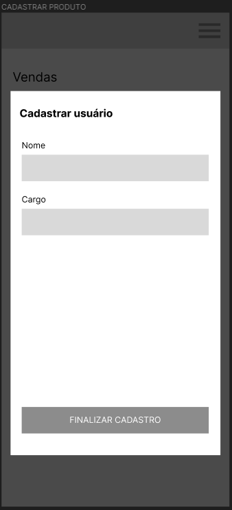
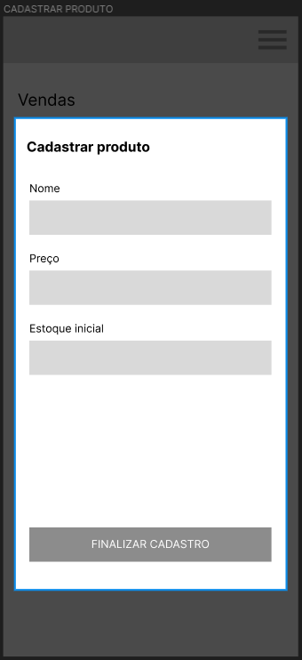
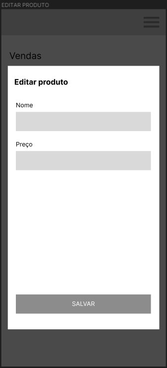
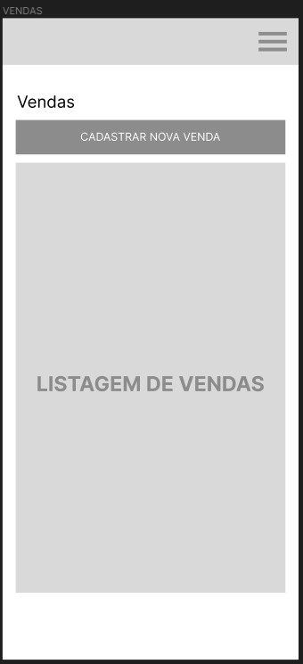

# Programação de Funcionalidades

Pré-requisitos: <a href="2-Especificação do Projeto.md"> Especificação do Projeto</a>, <a href="3-Projeto de Interface.md"> Projeto de Interface</a>, <a href="4-Metodologia.md"> Metodologia</a>, <a href="3-Projeto de Interface.md"> Projeto de Interface</a>, <a href="5-Arquitetura da Solução.md"> Arquitetura da Solução</a>

Nesta seção são apresentadas as telas desenvolvidas para cada uma das funcionalidades do sistema.

## Gestão de Usuários (RF-02)
A tela relacionada aos vendedores no sistema contém o rol de vendedores registrados. Nessa tela, estarão disponíveis as opções para cadastrar novo vendedor e editar ou remover os cadastros realizados. 

Artefatos desenvolvidos para atender ao requisito:

|Requisito    | Descrição do Requisito  | Artefato(s) produzido(s) |
|------|-----------------------------------------|----|
|RF-02|O sistema deve permitir cadastrar, visualizar e remover vendedores | Domain\Interfaces\IVendedorApplication.cs | 

## Gestão de produtos (RF-03)
A tela de Cadastro de Produtos no sistema exibe uma lista com os últimos produtos inseridos (cada ítem listado contém ícones que permitirão a sua edição ou exclusão). Ao clicar no botão 'Cadastrar Produto' um formulário é aberto com campos para inserir o nome, preço e estoque inicial do produto. Depois de concluído o cadastro, clicando no botão 'Salvar' essas informações são enviadas ao SGBD MySQL Server e registradas.O mesmo acontece ao clicar nos ícones 'Editar e Remover'.

Artefatos desenvolvidos para atender ao requisito:

|Requisito    | Descrição do Requisito  | Artefato(s) produzido(s) |
|------|-----------------------------------------|----|
|RF-03|O sistema deve permitir cadastrar, visualizar e remover os produtos da loja | Domain\Interfaces\IProdutoApplication.cs | 

## Gestão de Vendas (RF-06 / RF-07)
Na tela de Vendas constará uma lista de produtos com seus respectivos preços e a lista de funcionários registrados. O funcionário selecionará seu nome e o produto a ser vendido para conseguir finalizar a venda. 

Artefatos desenvolvidos para atender ao requisito:

|Requisito    | Descrição do Requisito  | Artefato(s) produzido(s) |
|------|-----------------------------------------|----|
|RF-06|O sistema deve permitir registrar as vendas realizadas | Domain\Interfaces\IVendaApplication.cs | 
|RF-07|O sistema deve permitir cadastrar, visualizar e remover vendas | Domain\Interfaces\IVendaApplication.cs | 

- O softtware foi desenvolvido utilizando a o Framework ASP.Net MVC, BD MySQL server e APIs no backend. Para o frontend, as ferramentas utilizadas foram HTML, CSS, JavaScript utilizando a plataforma do Vercel. Para mobile utilizamos React Native.
